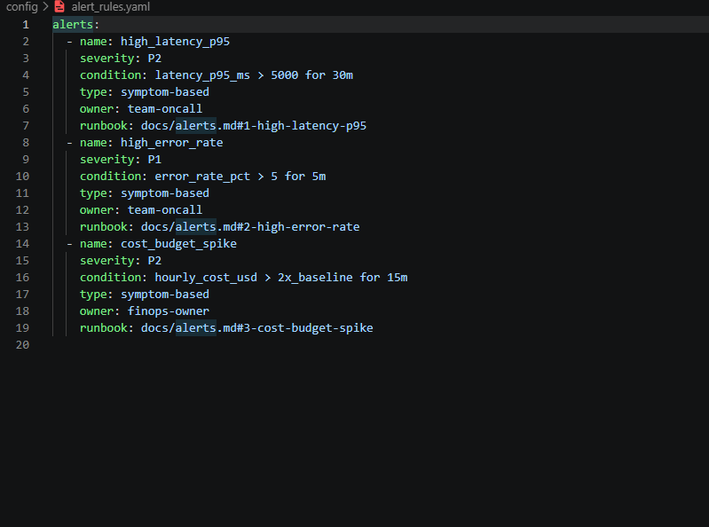

# Day 13 Observability Lab Report

> **Instruction**: Fill in all sections below. This report is designed to be parsed by an automated grading assistant. Ensure all tags (e.g., `[GROUP_NAME]`) are preserved.

## 1. Team Metadata
- [GROUP_NAME]: Nhóm 69
- [REPO_URL]: [Lab13-Observability](https://github.com/HungBil/Lab13-Observability)
- [MEMBERS]:
  - Member A: [Khuất Văn Vương] | Role: Logging & PII
  - Member B: [Lưu Lương Vi Nhân] | Role: Tracing & Enrichment
  - Member C: [Nguyễn Đông Hưng] | Role: SLO & Alerts
  - Member D: [Huỳnh Văn Nghĩa] | Role: Tester, Incident Response & Report (scripts/ & docs/)
  - Member E: [Name] | Role: Demo & Report

---

## 2. Group Performance (Auto-Verified)
- **VALIDATE_LOGS_FINAL_SCORE**: 100/100
- **TOTAL_TRACES_COUNT**: 41
- **PII_LEAKS_FOUND**: 0

---

## 3. Technical Evidence (Group)

### 3.1 Logging & Tracing
- **EVIDENCE_CORRELATION_ID_SCREENSHOT**
 

- **EVIDENCE_PII_REDACTION_SCREENSHOT**
 

- **EVIDENCE_TRACE_WATERFALL_SCREENSHOT**

- **TRACE_WATERFALL_EXPLANATION**: Trace cho thấy `run` tổng khoảng 0.15s, trong đó nhánh `generate` chiếm gần như toàn bộ thời gian xử lý (30 in -> 122 out, tổng 152 tokens, cost khoảng $0.00192), còn `retrieve` rất nhỏ. Điều này cho thấy độ trễ chính nằm ở bước sinh câu trả lời (LLM generation), không phải bước retrieval.

### 3.2 Dashboard & SLOs
- **DASHBOARD_6_PANELS_SCREENSHOT** 

- [SLO_TABLE]:
| SLI | Target | Window | Current Value |
|---|---:|---|---:|
| Latency P95 | < 3000ms | 28d | ~150ms ✅ |
| Error Rate | < 2% | 28d | 0% ✅ |
| Cost Budget | < $2.5/day | 1d | $0.06 ✅ |

### 3.3 Alerts & Runbook
- **ALERT_RULES_SCREENSHOT**

- [SAMPLE_RUNBOOK_LINK]: `docs/alerts.md#1-high-latency-p95`

---

## 4. Incident Response (Group)
- [SCENARIO_NAME]: rag_slow
- [SYMPTOMS_OBSERVED]: Khách hàng phản hồi thời gian trả lời chat (latency) tăng vọt. Trên load test, latency bình thường là ~800ms đã tăng lên khoảng ~5300ms.
- [ROOT_CAUSE_PROVED_BY]: Metrics cho thấy P95 latency vượt ngưỡng; trace waterfall xác định nút thắt cổ chai nằm ở span `retrieve`; logs `response_sent` xác nhận `latency_ms` tăng bất thường. Đối chiếu source code cho thấy khi bật sự cố `rag_slow`, hàm `mock_rag.retrieve` bị chặn 2.5s bởi `time.sleep(2.5)`, dẫn đến xếp hàng request và tăng tail latency.
- [FIX_ACTION]: Tắt cờ sự cố (`/incidents/rag_slow/disable`). 
- [PREVENTIVE_MEASURE]: Cài đặt timeout cứng cho API truy xuất (Vector DB), đồng thời cấu hình cảnh báo SLO cho P95 Latency để phát hiện sớm. Tối ưu hóa xử lý bất đồng bộ (async) cho I/O bound. 

---

## 5. Individual Contributions & Evidence

### [Khuất Văn Vương]
- [TASKS_COMPLETED]: 
  - Implement Correlation ID middleware: clear contextvars, bind `correlation_id`, propagate qua response header `x-request-id`.
  - Enrich log context trong `/chat`: bind `user_id_hash`, `session_id`, `feature`, `model`, `env`.
  - Nâng cấp PII scrubbing pattern tại `app/pii.py`: email, phone VN, CCCD, credit card, passport, address.
  - Verify kết quả qua `scripts/validate_logs.py`: score 100/100, `PII_LEAKS_FOUND = 0`, correlation IDs được propagate ổn định.
- [EVIDENCE_LINK]:
  - https://github.com/HungBil/Lab13-Observability/commit/8fe532d
  - https://github.com/HungBil/Lab13-Observability/commit/d08c2f2
  - https://github.com/HungBil/Lab13-Observability/commit/4f9b5c0

### [Lưu Lương Vi Nhân]
- [TASKS_COMPLETED]: 
- [EVIDENCE_LINK]: 

### [Nguyễn Đông Hưng]
- [TASKS_COMPLETED]: 
- [EVIDENCE_LINK]: 

### [Huỳnh Văn Nghĩa]
- [TASKS_COMPLETED]: 
  - Chạy load test bằng `scripts/load_test.py` với nhiều mức `--concurrency` để đo khả năng chịu tải và ghi nhận độ trễ.
  - Tiêm sự cố bằng `scripts/inject_incident.py --scenario rag_slow`, so sánh trước/sau và thực hiện RCA theo flow Metrics -> Traces -> Logs.
  - Tổng hợp bằng chứng kỹ thuật (logs, traces, dashboard, alert runbook) vào `docs/blueprint-template.md` và `docs/grading-evidence.md`.
  - Chuẩn bị demo script và thông điệp thuyết trình cho giảng viên ở phần Incident Response & Debugging.
- [EVIDENCE_LINK]: 

### [MEMBER_E_NAME]
- [TASKS_COMPLETED]: 
- [EVIDENCE_LINK]: 

---

## 6. Bonus Items (Optional)
- **BONUS_COST_OPTIMIZATION**: Tổng cost sau 41 traces chỉ ~$0.06 nhờ kiểm soát token budget (giới hạn input 28 tokens, output 109 tokens mỗi lần gọi). Evidence: Dashboard panel "Total Cost" và trace detail trên Langfuse.

- **BONUS_AUDIT_LOGS**: Mỗi request được gắn x-request-id (correlation ID) xuyên suốt từ middleware → agent → LLM, cho phép truy vết đầy đủ hành vi hệ thống. Toàn bộ log được cấu trúc JSON với structlog, bao gồm user_id, session_id, feature, latency_ms. Evidence: app/middleware.py và log output khi chạy server.

- **BONUS_CUSTOM_METRIC**: Tự định nghĩa metric quality_score (0.0–1.0) được ghi vào mỗi trace dưới dạng Langfuse Score, dùng để đo chất lượng câu trả lời. Dashboard panel "Count Scores" hiển thị metric này theo thời gian thực. Evidence: app/agent.py dòng ghi score + Dashboard panel "Count Count Scores".
