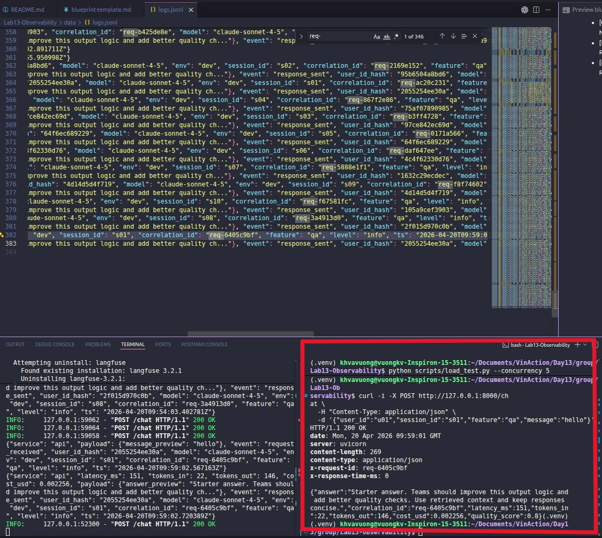
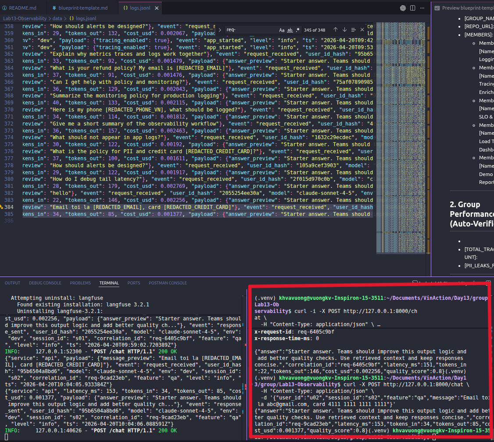
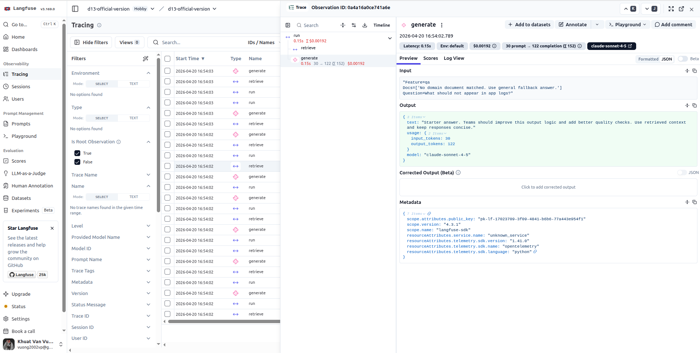
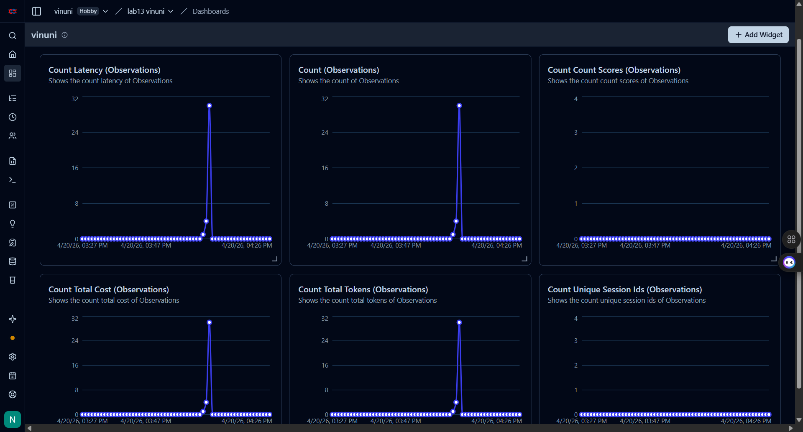

# Day 13 Observability Lab Report

> **Instruction**: Fill in all sections below. This report is designed to be parsed by an automated grading assistant. Ensure all tags (e.g., `[GROUP_NAME]`) are preserved.

## 1. Team Metadata
- [GROUP_NAME]: 
- [REPO_URL]: [Lab13-Observability](https://github.com/HungBil/Lab13-Observability)
- [MEMBERS]:
  - Member A: [Khuất Văn Vương] | Role: Logging & PII
  - Member B: [Lưu Lương Vi Nhân] | Role: Tracing & Enrichment
  - Member C: [Nguyễn Đông Hưng] | Role: SLO & Alerts
  - Member D: [Huỳnh Văn Nghĩa] | Role: Tester, Incident Response & Report (scripts/ & docs/)
  - Member E: [Name] | Role: Demo & Report

---

## 2. Group Performance (Auto-Verified)
- [VALIDATE_LOGS_FINAL_SCORE]: 100/100
- [TOTAL_TRACES_COUNT]: 
- [PII_LEAKS_FOUND]: 

---

## 3. Technical Evidence (Group)

### 3.1 Logging & Tracing
- **EVIDENCE_CORRELATION_ID_SCREENSHOT**
 
- **EVIDENCE_PII_REDACTION_SCREENSHOT**
 
- **EVIDENCE_TRACE_WATERFALL_SCREENSHOT**
 
- **TRACE_WATERFALL_EXPLANATION**: Trace cho thấy `run` tổng khoảng 0.15s, trong đó nhánh `generate` chiếm gần như toàn bộ thời gian xử lý (30 in -> 122 out, tổng 152 tokens, cost khoảng $0.00192), còn `retrieve` rất nhỏ. Điều này cho thấy độ trễ chính nằm ở bước sinh câu trả lời (LLM generation), không phải bước retrieval.

### 3.2 Dashboard & SLOs
- **DASHBOARD_6_PANELS_SCREENSHOT** 

- [SLO_TABLE]:
| SLI | Target | Window | Current Value |
|---|---:|---|---:|
| Latency P95 | < 3000ms | 28d | |
| Error Rate | < 2% | 28d | |
| Cost Budget | < $2.5/day | 1d | |

### 3.3 Alerts & Runbook
- [ALERT_RULES_SCREENSHOT]: [Path to image]
- [SAMPLE_RUNBOOK_LINK]: docs/alerts.md#high-latency-p95

---

## 4. Incident Response (Group)
- [SCENARIO_NAME]: rag_slow
- [SYMPTOMS_OBSERVED]: Khách hàng phản hồi thời gian trả lời chat (latency) tăng vọt. Trên load test, latency bình bình là ~800ms đã tăng lên khoảng ~5300ms.
- [ROOT_CAUSE_PROVED_BY]: Metrics cho thay P95 latency vuot nguong; trace waterfall xac dinh nut that co chai nam o span `retrieve`; logs `response_sent` xac nhan `latency_ms` tang bat thuong. Doi chieu source code cho thay khi bat incident `rag_slow`, ham `mock_rag.retrieve` bi chan 2.5s boi `time.sleep(2.5)`, dan den xep hang request va tang tail latency.
- [FIX_ACTION]: Tắt cờ sự cố (`/incidents/rag_slow/disable`). 
- [PREVENTIVE_MEASURE]: Cài đặt timeout cứng cho API truy xuất (Vector DB), đồng thời cấu hình cảnh báo SLO cho P95 Latency để phát hiện sớm. Tối ưu hóa xử lý bất đồng bộ (async) cho I/O bound. 

---

## 5. Individual Contributions & Evidence

### [MEMBER_A_NAME]
- [TASKS_COMPLETED]: 
- [EVIDENCE_LINK]: (Link to specific commit or PR)

### [MEMBER_B_NAME]
- [TASKS_COMPLETED]: 
- [EVIDENCE_LINK]: 

### [MEMBER_C_NAME]
- [TASKS_COMPLETED]: 
- [EVIDENCE_LINK]: 

### [MEMBER_D_NAME]
- [TASKS_COMPLETED]: 
  - Chay load test bang `scripts/load_test.py` voi nhieu muc `--concurrency` de do kha nang chiu tai va ghi nhan do tre.
  - Tiem incident bang `scripts/inject_incident.py --scenario rag_slow`, so sanh truoc/sau va thuc hien RCA theo flow Metrics -> Traces -> Logs.
  - Tong hop bang chung ky thuat (logs, traces, dashboard, alert runbook) vao `docs/blueprint-template.md` va `docs/grading-evidence.md`.
  - Chuan bi demo script va thong diep thuyet trinh cho giang vien o phan Incident Response & Debugging.
- [EVIDENCE_LINK]: [Link pull request/commit cho scripts + docs cua Member D]

### [MEMBER_E_NAME]
- [TASKS_COMPLETED]: 
- [EVIDENCE_LINK]: 

---

## 6. Bonus Items (Optional)
- [BONUS_COST_OPTIMIZATION]: (Description + Evidence)
- [BONUS_AUDIT_LOGS]: (Description + Evidence)
- [BONUS_CUSTOM_METRIC]: (Description + Evidence)
